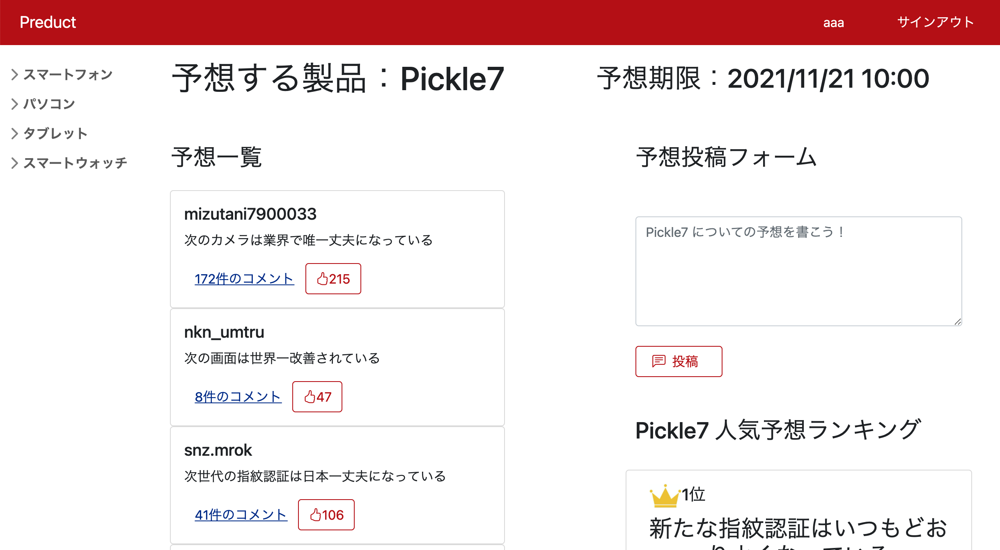

# Predict
新製品の発表会前にみんなで予想を投稿し議論しあうウェブアプリ

# How to Start
```bash
git clone git@github.com:KOKI9861/Preduct.git
cd Preduct/.devcontainer
docker-compose up -d
```
上記コマンドで  
フロントエンドがhttp://localhost:3000  
バックエンドがhttp://localhost:8000  
に起動する．

停止する際は
```bash
docker-compose stop
```
<br></br>
動かないときは
```bash
docker container ls
```
でコンテナが動いていることを確認  
動いていたら以下でログの確認ができる
```bash
docker logs <コンテナ名>
```


# Image

